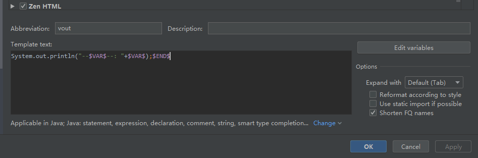

# 基本概念：

## 项目组织结构

idea不像eclipse拥有工作空间的概念

idea是以project-module来组织project

idea一个窗口中只有一个project，但可以有多个module。

如果有多个project，就必须多开窗口

# 初次使用idea的配置
打开设置选项卡：  file -> setting

##  重要配置

1. 配置jdk 

   project structure 中进行配置，常见项目时配置 均可

2. 配置maven  （bin，settings.xml，localrepository，auto download source）

3. 修改编码为utf-8

   setting -> editor -> file encoding 进行配置

## 其他便利性配置
- 代码提示忽略大小写： setting -> code completion -> case sensitive completion

- 打开文件允许多行显示  settring -> editor -> genaeral ->editor tabs -> 取消勾选 show tabs in single row

- 单行注释`//` 空两行： settring -> editor  -> code style -> java -> code generation ->coment code 

- 打开idea时不自动启动上次的项目 setting - > apperance -> system setting -> startup/shut down

- 行号,方法分割线显示： setting -> editor -> general -> apperance -> (show line number,show method separators)

  

  

# 图标及功能指南
## 设置代码检查等级

检查等级：当然等级越高越占用内存

- `Inspections` 为最高等级检查，可以检查单词拼写，语法错误，变量使用，方法之间调用等。
- `Syntax` 可以检查单词拼写，简单语法错误。
- `None` 不设置检查。

## 代码重构

1. 将一段代码提取为一个方法
2. 全局修改变量名/类名/接口名/方法名

# 代码生成：快捷键 tab

## 动态模板（live template）

可根据当前所属方法/类来生成对应的代码

**举例：debug 控制台打印**

点击Edit Variables 即可修改VAR变量映射的值，此处选择的是 context建议的变量

**使用方法：输入vout 再敲击tab键**

## 快速生成main

输入main 敲tab

自动生成public static void main(String[] args){}

## 遍历集合或数组

输入 数组/集合.for   ：提示快捷生成遍历

### 举例以后看到了来补充

# 快捷键介绍与个人定制

先将快捷键设置为 eclipse：

​	setting -> keymap -> eclipse 

然后再进行顺手模改版：

## 快捷键介绍

- show context action（idea上下文提示）：`alt+enter`

  会根据光标的不同位置做出不同的提示

- 显示最近打开的文件: `ctrl+e`

- surrounding code 生成： `shift+alt+z` 

- 智能全体 import并删除无用import: `ctrl+alt+o`

- 格式化代码 : `ctrl+alt+l`

## 个人定制

自动完成 `alt+/`: 基础代码提示、补充快捷键 

​	keymap -> Main menu -> code -> completion  -> base 

打开project structure (setting) ：`F12`

​	keymap -> main menue ->file -> project structure

## 快捷键、全局设置可导出

file-> exporing setting

# 无需保存

IntelliJ IDEA 是一个没有 Ctrl + S 的 IDE，所以每次修改完代码你只要管着运行或者调试即可，无需担心保存或者丢失代码。

# 必备插件及使用：

alibaba java coding  guideline：阿里编码规约提示

key-promoterX：熟悉快捷键，鼠标操作提示：快捷键

findBugs：扫描 proj/module/file中的bug

db navigator：数据库GUI

maven helper：找到maven依赖冲突，查看maven树桩依赖结构

translation：翻译插件，可设置google baidu youdao 翻译引擎

# 问题

## 每次新建proj都需要配置maven

解决：file -》 other setting ，即可配置 default setting

## 无 新建类或packg 选项卡
idea只有在Source Root或 Test Source Root 目录下，才是会被编译的
因为也只有在这两个目录下，右键new 才会出现 new java class 和 new package

被标记为 Source Root的package 会变成蓝色
被标记为 Test Source Root的package 会变成绿色

**如何标记？**
右键目录：
    Mart directory as -> Source Root
    Mart directory as -> Test Source Root

## 总是报can not resolve type *

1. 未配置jdk

2. 未被maven管理，无法读取并解析pom中的依赖，右键projectName -> add framework -> maven

3. maven的scope范围问题 provide runtime test compile 

   在project structure 查看module ->dependencies 调整各依赖的scope

   

# working  代码重构、生成

​	

**常用重构**

 `Refactor` 重构 
`Signarture` 签名 
`Extract` 提取 
`Field` 属性 
`Constant` 常量 
`Method` 方法 
`Parameter` 参数 
`Surround` 环绕 

## mark一下 ，以后来修改成自己的

**idea原生快捷键：**

- 重命名文件、方法、属性等（Rename）：Shift+F6，同时被修改处在其他被调用的地方也会随之更改，修改文件名，如类名，右键当前类文件 -> Refactor -> Rename，便会看到快捷键提示 Shift+F6

- 重构类、方法（Change Signarture）：Ctrl+F6

- 提取当前选择为变量（Extract Variable）：Ctrl+Alt+V

- 提取当前选择为类的私有属性（Extract Field）：Ctrl+Alt+F

- 提取当前选择为常量（Extract Constant）：Ctrl+Alt+C

- 提取当前选择为方法（Extract Method）：Ctrl+Alt+M

- 提取当前选择为方法参数（Extract Parameter）：Ctrl+Alt+P

- 提取代码块至 if、try 等结构中（Surround With）：Ctrl+Alt+T

- 创建模块文件等（New）：Ctrl+Alt+N

- 创建测试用例（Test）：Ctrl+Shift+T

- 重构菜单（Refactor for this）：Ctrl+T

- 英雄总是最后登场！重构一切的男人！！！：Ctrl+Shift+Alt+T
  
  
  
  快捷键自动跳转到错误， keymap搜error
  
  滚动条左右，上下移动 搜scroll 
  

# 如果实在找不到问题，就invalid cache and Restart