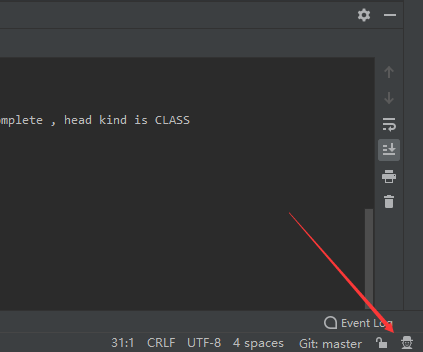
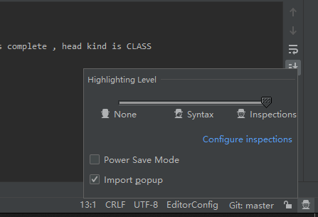

# 基本概念：

## 项目组织结构

idea不像eclipse拥有工作空间的概念

idea是以project-module来组织project

idea一个窗口中只有一个project，但可以有多个module。

如果有多个project，就必须多开窗口

# 初次使用idea的配置
打开设置选项卡：  file -> setting

##  重要配置

1. 配置jdk 

   project structure 中进行配置，常见项目时配置 均可

2. 配置maven  （bin，settings.xml，localrepository，auto download source）

3. 修改编码为utf-8

   setting -> editor -> file encoding 进行配置

## 其他便利性配置
- 代码提示忽略大小写： setting -> code completion -> case sensitive completion
- 打开文件允许多行显示  settring -> editor -> genaeral ->editor tabs -> 取消勾选 show tabs in single row
- 单行注释`//` 空两行： settring -> editor  -> code style -> java -> code generation ->coment code 
- 打开idea时不自动启动上次的项目 setting - > apperance -> system setting -> startup/shut down
- s

# 图标及功能指南
## 设置代码检查等级

检查等级：当然等级越高越占用内存

- `Inspections` 为最高等级检查，可以检查单词拼写，语法错误，变量使用，方法之间调用等。
- `Syntax` 可以检查单词拼写，简单语法错误。
- `None` 不设置检查。

## 代码重构

# 快捷键介绍与个人定制

先将快捷键设置为 eclipse：

​	setting -> keymap -> eclipse 

然后再进行顺手模改版：

## 快捷键介绍

- show context action（idea上下文提示）：`alt+enter`

  会根据光标的不同位置做出不同的提示

- 显示最近打开的文件: `ctrl+e`

 

## 个人定制

自动完成 `alt+/`: 基础代码提示、补充快捷键 

​	keymap -> Main menu -> code -> completion  -> base 

打开project structure (setting) ：`F12`

​	keymap -> main menue ->file -> project structure

# 问题
## 无 新建类或packg 选项卡
idea只有在Source Root或 Test Source Root 目录下，才是会被编译的
因为也只有在这两个目录下，右键new 才会出现 new java class 和 new package

被标记为 Source Root的package 会变成蓝色
被标记为 Test Source Root的package 会变成绿色

如何标记？
右键目录：
    Mart directory as -> Source Root
    Mart directory as -> Test Source Root

## 总是报can not resolve type *

1. 未配置jdk

2. 未被maven管理，无法读取并解析pom中的依赖，右键projectName -> add framework -> maven

3. maven的scope范围问题 provide runtime test compile 

   在project structure 查看module ->dependencies 调整各依赖的scope

   

# working  代码重构

